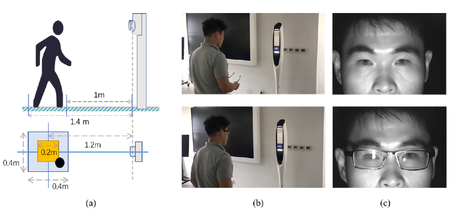
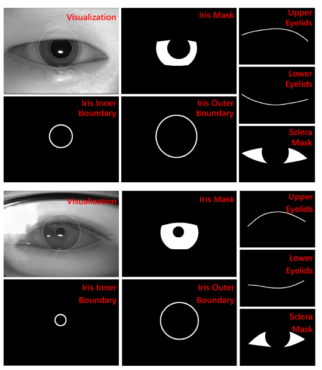

## **1. Introduction**

A key problem of iris recognition at a distance is that a large portion of captured iris images is nonideal because of narrow depth of field (DoF), noncooperative user movement, incongruous exposure time and so on. Current iris recognition systems usually filter out these low-quality images using strict criteria of image quality evaluation (IQA). However, this strategy inevitably leads to a waste of device capacity and low throughput. Therefore, a better and practical solution is to make the utmost of degraded iris images for personal identification. We announce the availability of a long-range captured dataset containing 3,756 iris images of various degradation factors from 98 subjects. An evaluation benchmark is built upon the dataset for a comparative study on preprocessing and recognition of NIR iris images in high-throughput scenarios. The datasets, manual annotations and evaluation toolkit are publicly available.

## **2. Descriptions and Statistics of the Database**

### **Image collection**
<!-- <iframe height=498 width=510 src="collection_glasses.mp4"> -->
The schematic and setup of blur-varying iris image collection of this database at a distance are shown as following.



The next generation of CASIA-LR-Cam bundled with NIR illumination at a wavelength of 830 nm was employed as the capturing device. Its standoff distance is approximately 1.2 meters with a DoF of over 20 centimeters. The field of view (FoV) is approximately 20 degrees. The device was placed in an indoor environment under no extra lighting sources. During the process of image collection, the subjects were obliged to move freely in the restricted square area 1.0~1.4 meters away from the device. Specifically, they could casually step forward and backward, left and right.

While moving inside the restricted area, the subjects were guided by the indication signal on the GUI screen to look at different directions for approximately 30 seconds in a single session. Two separate sessions were launched in the daytime under the same conditions, and the interval was one week. If the subject was wearing glasses, he or she needed to take them off in either of the two sessions (`play the video and see`). 

> Session 1 With Glasses

<video src="./collection_glasses.mp4" width="800px" height="600px" controls="controls"></video>

> Session 2 No glasses

<video src="./collection_noglasses.mp4" width="800px" height="600px" controls="controls"></video>

The acquired iris image sequences were captured at 5~10 frames per second. The resolution of each frame was 3840x2748. The frames in which irides were completely invisible caused by blinking or squinting were thrown away. Then evenly spaced images are extracted from the processed sequence every 5 frames. On average, approximately 20 images of each subject were retained.

### **Statistics of the dataset**

| Attributes              |                  The database                   |
| ----------------------- | :---------------------------------------------: |
| Camera Type             |                 CASIA-LR-Cam II                 |
| Illumination            |        NIR and natural lighting sources         |
| Total pixel             |                    3840x2748                    |
| Cropped eye region      |                     640x480                     |
| Sessions                |              Two separate sessions              |
| Institution of subjects | Graduate students and staff of CASIA and TAfIRT |
| Standoff distance       |                    1.0~1.4m                     |
| Working mode            |    Step freely within a moderate square area    |
| Depth of field          |                    ca. 20cm                     |
| No. of subjects         |                       98                        |
| No. of Classes          |                       195                       |
| No. of Images           |                      3,765                      |
| Images per class        |                     ca. 19                      |
| Pairs of Images         |   39,418 intraclass and 7,406,312 interclass    |

### **Mannual Annotations**

Each image in the dataset is manually annotated with binary maps of iris masks, inner and outer iris boundaries, upper and lower eyelids, and sclera masks shown as below.



### **Evaluation Toolkit**

[IrisStat_V3.0.rar](IrisStat_V3.0.rar)

The package of evaluation toolkit is organized as below.

```
IrisIQA
│
└───config/
│
└───out/ 
│
└───utils/
|     computeMotionblur.m
|     computeSharpness.m
|     ini2struct.m
|     Integral.m
|     progressbar.m
│     struct2ini.m
|
└───MotionBlur_Main.m
│
└───Sharpness_Main.m

 
Segmentation
│
└───config/
│
└───out/ 
│
└───utils/
|    evalSeg.m
|    Hausdorff.m
|    ini2struct.m
|    progressbar.m
|    struct2ini.m 
│
└───IrisSeg_Main.m

Recognition
│
└───config/
│
└───out/ 
│
└───utils/
|     ACC.m
|     Bitshift.m
|     colors.mat
|     compute_iriscode_sim.m
|     compute_om_sim.m
|     compute_vector_sim.m
|     draw_CMC_curve.m
|     draw_DET_curve.m
|     EER.m
|     IdentiACC.m
|     linspecer.m
|     Merge_Multi_CMC_Curve.m
|     Merge_Multi_Det_Curve.m
|     plot_styles.mat
|     progressbar.m
|     VerfiACC.m
│
└───IrisRec_main.m
```

- The main function of iris IQA evaluating sharpness is `Sharpness_Main.m`.
- The main function of iris segmentation evaluation is `IrisSeg_Main.m`.
- The main function of iris recognition evaluation is `IrisRec_Main.m`.

## **Database Organization**

The database package comprises the following components organized in multiple directories.

```
|
circle_params
|  │
|  └───xxxL(R)_xx.ini
|
ellipse_params
|  │
|  └───xxxL(R)_xx.ini 
|
image
|  │
|  └───xxxL(R)_xx.jpg
|
iris_edge
|  │
|  └───xxxL(R)_xx.png
|
iris_edge_mask
|  │
|  └───xxxL(R)_xx.png
|
iris_edge_rough
|  │
|  └───xxxL(R)_xx.png
|
iris_mask
|  │
|  └───xxxL(R)_xx.png
|
lower_eyelids_edge
|  │
|  └───xxxL(R)_xx.png
|
lower_eyelids_edge_rough
|  │
|  └───xxxL(R)_xx.png
|
pupil_edge
|  │
|  └───xxxL(R)_xx.png
|
pupil_edge_mask
|  │
|  └───xxxL(R)_xx.png
|
pupil_edge_rough
|  │
|  └───xxxL(R)_xx.png
|
pupil_mask
|  │
|  └───xxxL(R)_xx.png
|
pupil_edge_rough
|  │
|  └───xxxL(R)_xx.png
|
pupil_mask
|  │
|  └───xxxL(R)_xx.png
|
sclera_mask
|  │
|  └───xxxL(R)_xx.png
|
up_eyelids_edge
|  │
|  └───xxxL(R)_xx.png
|
up_eyelids_edge_rough
|  │
|  └───xxxL(R)_xx.png
|
vis_result
|  │
|  └───xxxL(R)_xx.png
|
vis_result_new
|  │
|  └───xxxL(R)_xx.png
|
imgList.txt
```

The file naming rule is "`xxxL(R)_xx`", where "`xxx`" denotes the unique identifier of the subject, "`L`" denotes left eye and "`R`" denotes right eye and "`xx`" denotes the index of the image in the class, e.g., `001L_01`. All the filenames of the iris images and belonging classes are stored in `imgList.txt`.

## **Copyright Note and Contacts**

The database is released for research and educational purposes. We hold no liability for any undesirable consequences of using the database. All rights of the database are reserved. Any person or organization is not permitted to distribute, publish, copy, or disseminate this database. In all documents and papers that report experimental results based on this database, our efforts in constructing the database should be acknowledged such as “Portions of the research in this paper use the dataset collected by Smart Iris Recognition (SIR) group from the Chinese Academy of Sciences, Institute of Automation (CASIA)”.

To receive a copy of the database, a non-student researcher must manually sign the [License Agreement](license_agreement.pdf) and agree to observe the restrictions. The signed document should be digitized and sent through email to: sir@cripac.ia.ac.cn
