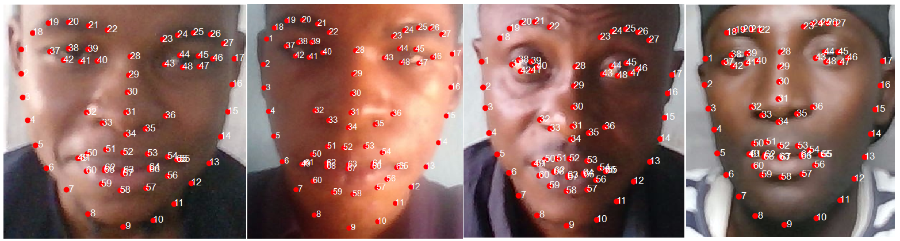

## Introduction

Over the years, numerous face databases have been published that brought about exciting breakthrough in the facial biometric research field, most especially from the recent trend of deep learning contributions. However, as investigated by researchers, most of these databases are demographically imbalanced and often contain few number of African cohorts. Of those with relatively large number of the Africans, the databases are usually wild (downloaded from the internet or digitalised from printed photographs). Methods that adopt these skewed databases often exhibits some form of performance bias that can result to unintended consequences for real time applications. As such, there is need for more demographically inclusive datasets. CASIA-Face-Africa is developed to provide solution to this problem. It is an all-African database that is made to be used as a complementary database with the existing databases to balance the number of the African cohorts in the published datasets and improve their demographic inclusiveness.

## DESCRIPTION

The database images were captured at various locations in Nigeria, Africa. About 1150 volunteers participated in the capturing exercise. The images of each subject were captured concurrently using 3 cameras. Two visible wavelength (VW) cameras and one near-infrared (NIR) camera. The capturing was done in various sessions over a period of 3 months. Some of the subjects have images captured in multiple sessions while majority of the subjects have their images captured in a single session.

*Figure 1: The cameras arrangement set-up was made to be same in all the capturing sessions*

---

For each capturing instance, 3 to 10 still images were captured by each camera at a fixed time interval of 1 to 3 seconds. For some subjects, an external illumination light source was used for capturing additional images of that subjects. Also, some subjects were asked to use face accessory such as eye glasses for multiple capturing. The captured images were then organized and their land mark labelled. The organized database comprises a total of 38,546 images from 1,183 subjects. Specifically, 12,063 images captured by VW camera 1 at the resolution of 1332×1080, 13,232 images are captured by VW camera 2 at the resolution of 787 × 962, and 13,251 images are captured by NIR camera at the resolution of 983 × 877. Some samples of the captured images are shown in Figure 2, Figure 3 and Figure 4.

*Figure 2: Sample of a single subject images*

---

*Figure 3: Sample of subject Expressions*

---

*Figure 4: Sample of labelled face images*

---

## Database Organization

The database package comprises of the following components organised in multiple directories:

  - Images folder: This contain the actual face images. Each file is named as SubjectID_ImageNumber.jpg. The SubjectID is a unique number for each subject and the ImageNumber is a sequential number for images of the same subject.
  - Subjects folder: This contain the corresponding ini files that describe the unique subjects in the images. Each file is named with the ID of the subject as SubjectID.ini.
  - Attributes folder: This contain the corresponding ini files that describes each individual face image. Each file is named with its corresponding face image name as SubjectID_ImageNumber.ini
  - Protocols folder: This contain the files named with each of the defined proposed protocols. Example of the names: ID-V-All-Ep1.ini, ID-I-Split-Ep3.ini, etc. Each of the files contains list of all the images allowed to be used for that protocol which are categorised as either Training, Testing, Target or Query as described in the database paper.
  - Codes folder: These are evaluation codes in multiple programming languages that can be used to easily adopt the database for various applications.

## Copyright Note and Contacts

The database is released for research and educational purposes. We hold no liability for any undesirable consequences of using the database. All rights of the CASIA database are reserved. Any person or organization is not permitted to distribute, publish, copy, or disseminate this database. In all documents and papers that report experimental results based on this database, our efforts in constructing the database should be acknowledged such as "Portions of the research in this paper use the CASIA-Face-Africa collected by the Chinese Academy of Sciences' Institute of Automation (CASIA)".

To receive a copy of the database, a **non-student researcher** must **manually sign** the [License Agreement](license_agreement.pdf) and agree to **observe the restrictions**. The signed document should be **digitized** and **sent through** email to:[sir@cripac.ia.ac.cn](mailto://sir@cripac.ia.ac.cn)