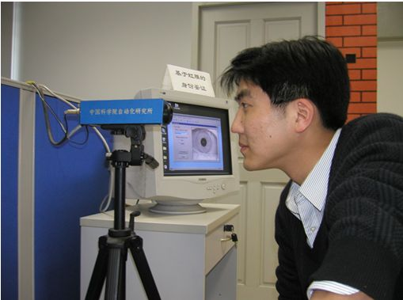
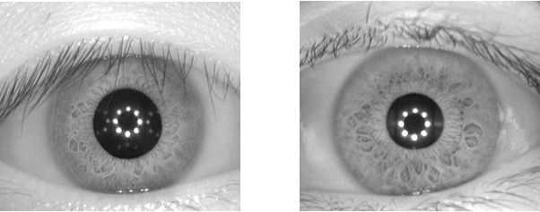
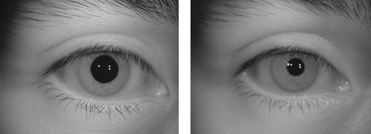
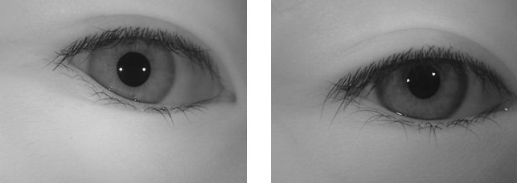
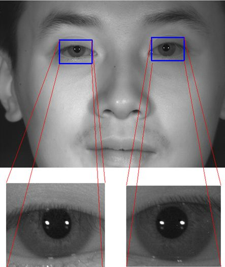
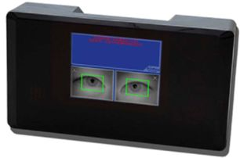
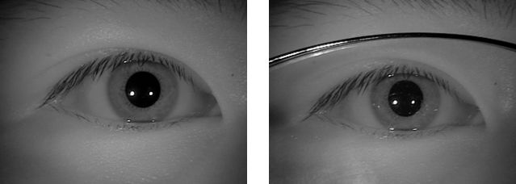
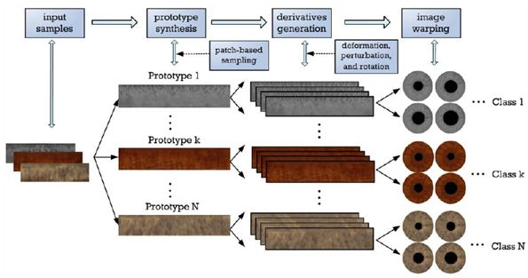
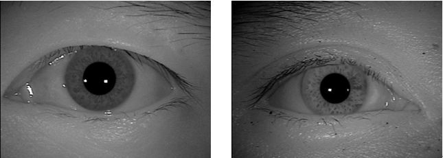

## [Download the whole database (1.86GB)](http://biometrics.idealtest.org/downloadDB.do?id=4)

OR 
Download the separated subsets below

|                                                                                                      |                                                                                                    |
| ---------------------------------------------------------------------------------------------------- | -------------------------------------------------------------------------------------------------- |
| [Download CASIA-Iris-Interval (30.9MB)](http://biometrics.idealtest.org/downloadDB.do?id=4&subset=1) | [Download CASIA-Iris-Lamp (390MB)](http://biometrics.idealtest.org/downloadDB.do?id=4&subset=2)    |
| [Download CASIA-Iris-Twins (60MB)](http://biometrics.idealtest.org/downloadDB.do?id=4&subset=3)      | [Download CASIA-Iris-Distance(767MB)](http://biometrics.idealtest.org/downloadDB.do?id=4&subset=4) |
| [Download CASIA-Iris-Thousand (490MB)](http://biometrics.idealtest.org/downloadDB.do?id=4&subset=5)  | [Download CASIA-Iris-Syn (171MB)](http://biometrics.idealtest.org/downloadDB.do?id=4&subset=6)     |

## 1. Introduction

With the pronounced need for reliable personal identification, iris recognition has become an important enabling technology in our society. Although an iris pattern is naturally an ideal identifier, the development of a high-performance iris recognition algorithm and transferring it from research lab to practical applications is still a challenging task. Automatic iris recognition has to face unpredictable variations of iris images in real-world applications. For example, recognition of iris images of poor quality, nonlinearly deformed iris images, iris images at a distance, iris images on the move, and faked iris images all are open problems in iris recognition. A basic work to solve the problems is to design and develop a high quality iris image database including all these variations. Moreover, a novel iris image database may help identify some frontier problems in iris recognition and leads to a new generation of iris recognition technology.

CASIA Iris Image Database (CASIA-Iris) developed by our research group has been released to the international biometrics community and updated from CASIA-IrisV1 to CASIA-IrisV3 since 2002. More than 3,000 users from 70 countries or regions have downloaded CASIA-Iris and much excellent work on iris recognition has been done based on these iris image databases. Although great progress of iris recognition has been achieved since 1990s, the rapid growth of iris recognition applications has clearly highlighted two challenges, i.e. usability and scalability.

Usability is the largest bottleneck of current iris recognition. It is a trend to develop long-range iris image acquisition systems for friendly user authentication. However, iris images captured at a distance are more challenging than traditional close-up iris images. Lack of long-range iris image data in the public domain has hindered the research and development of next-generation iris recognition systems.

Most current iris recognition methods have been typically evaluated on medium sized iris image databases with a few hundreds of subjects. However, more and more large-scale iris recognition systems are deployed in real-world applications. Many new problems are met in classification and indexing of large-scale iris image databases. So scalability is another challenging issue in iris recognition.

In order to promote research on long-range and large-scale iris recognition systems,  we are pleased to release to the public domain CASIA Iris Image Database V4.0 (or CASIA-IrisV4 for short).

## 2. Brief Descriptions and Statistics of the Database

CASIA-IrisV4 is an extension of CASIA-IrisV3 and contains six subsets. The three subsets from CASIA-IrisV3 are CASIA-Iris-Interval, CASIA-Iris-Lamp, and CASIA-Iris-Twins respectively. The three new subsets are CASIA-Iris-Distance, CASIA-Iris-Thousand, and CASIA-Iris-Syn.

CASIA-IrisV4 contains a total of 54,601 iris images from more than 1,800 genuine subjects and 1,000 virtual subjects. All iris images are 8 bit gray-level JPEG files, collected under near infrared illumination or synthesized. Some statistics and features of each subset are given in Table 1. The six data sets were collected or synthesized at different times and CASIA-Iris-Interval, CASIA-Iris-Lamp, CASIA-Iris-Distance, CASIA-Iris-Thousand may have a small inter-subset overlap in subjects.

### 2.1  CASIA-Iris-Interval

   Iris images of CASIA-Iris-Interval were captured with our self-developed close-up iris camera (Fig.1). The most compelling feature of our iris camera is that we have designed a circular NIR LED array, with suitable luminous flux for iris imaging. Because of this novel design, our iris camera can capture very clear iris images (see Fig.2). CASIA-Iris-Interval is well-suited for studying the detailed texture features of iris images.

Fig.1 The self-developed iris camera used for collection of CASIA-Iris-Interval

Fig.2 Example iris images in CASIA-Iris-Interval

### 2.2  CASIA-Iris-Lamp

CASIA-Iris-Lamp was collected using a hand-held iris sensor produced by OKI (Fig.3). A lamp was turned on/off close to the subject to introduce more intra-class variations when we collected CASIA-Iris-Lamp. Elastic deformation of iris texture (Fig.4) due to pupil expansion and contraction under different illumination conditions is one of the most common and challenging issues in iris recognition. So CASIA-Iris-Lamp is good for studying problems of non-linear iris normalization and robust iris feature representation.

Fig.3 The hand-held iris camera used for collection of CASIA-Iris-Lamp

Fig.4 Example iris images in CASIA-Iris-Lamp 

### 2.3  CASIA-Iris-Twins

CASIA-Iris-Twins contains iris images of 100 pairs of twins, which were collected during Annual Twins Festival in Beijing using OKI's IRISPASS-h camera (Fig.5). Although iris is usually regarded as a kind of phenotypic biometric characteristics and even twins have their unique iris patterns, it is interesting to study the dissimilarity and similarity between iris images of twins.

Fig.5 Example iris images in CASIA-Iris-Twins 

### 2.4  CASIA-Iris-Distance

CASIA-Iris-Distance contains iris images captured using our self-developed long-range multi-modal biometric image acquisition and recognition system (LMBS, Fig.6). The advanced biometric sensor can recognize users from 3 meters away by actively searching iris, face or palmprint patterns in the visual field via an intelligent multi-camera imaging system. The LMBS is human-oriented by fusing computer vision, human computer interaction and multi-camera coordination technologies and improves greatly the usability of current biometric systems. The iris images of CASIA-Iris-Distance were captured by a high resolution camera so both dual-eye iris and face patterns are included in the image region of interest (Fig. 7). And detailed facial features such as skin pattern are also visible for multi-modal biometric information fusion.

Fig.6  The biometric sensor used for collection of CASIA-Iris-Distance

Fig.7  An example image in CASIA-Iris-Distance 

### 2.5  CASIA-Iris-Thousand

CASIA-Iris-Thousand contains 20,000 iris images from 1,000 subjects, which were collected using IKEMB-100 camera (Fig. 8) produced by [IrisKing](Http://www.irisking.com). IKEMB-100 is a dual-eye iris camera with friendly visual feedback, realizing the effect of “What You See Is What You Get”. The bounding boxes shown in the frontal LCD help users adjust their pose for high-quality iris image acquisition. The main sources of intra-class variations in CASIA-Iris-Thousand are eyeglasses and specular reflections. Since CASIA-Iris-Thousand is the first publicly available iris dataset with one thousand subjects, it is well-suited for studying the uniqueness of iris features and develop novel iris classification and indexing methods.

Fig.8 The iris camera used for collection of CASIA-Iris-Thousand

Fig.9  An example image in CASIA-Iris-Thousand 

### 2.6  CASIA-Iris-Syn

CASIA-Iris-Syn contains 10,000 synthesized iris images of 1,000 classes. The iris textures of these images are synthesized automatically from a subset of CASIA-IrisV1 with the approach described in [1] (Fig. 10). Then the iris ring regions were embedded into the real iris images, which makes the artificial iris images more realistic. The intra-class variations introduced into the synthesized iris dataset include deformation, blurring, and rotation, which raise a challenge problem for iris feature representation and matching. We have demonstrated in [1] that the synthesized iris images are visually realistic and most subjects can not distinguish genuine and artificial iris images. More importantly, the performance results tested on the synthesized iris image database have similar statistical characteristics to genuine iris database. So users of CASIA-IrisV4 are encouraged to use CASIA-Iris-Syn for iris recognition research and any suggestions are welcome. If CASIA-Iris-Syn proves to be successful for most researchers of iris recognition, we will provide more and more synthesized iris images in the future.

Fig. 10  Flowchart of the iris texture synthesis method for generation of CASIA-Iris-Syn

Fig. 11  Example iris images in CASIA-Iris-Syn
 
## 3. Database Organization  

The file name of each image in CASIA-IrisV4 is unique to each other and denotes some useful properties associated with the image such as subset category, left/right/double, subject ID, class ID, image ID etc. The file naming rules of all six subsets are listed as follows:

- The images of CASIA-Iris-Interval are stored as:

    root_path/CASIA-Iris-Interval/YYY/S1YYYENN.jpg

    YYY: the unique identifier of the subject in the subset

    E: ‘L’ denotes left eye and ‘R’ denotes right eye

    NN: the index of the image in the class

- The images of CASIA-Iris-Lamp are stored as:

    root_path/CASIA-Iris-Lamp/YYY/E/S2YYYENN.jpg

    YYY: the unique identifier of the subject in the subset

    E: ‘L’ denotes left eye and ‘R’ denotes right eye

    NN: the index of the image in the class

- The images of CASIA-Iris-Twins are stored as:

    root_path/CASIA-Iris-Twins\XX\YE\S3XXYENN.jpg

    XX: the index of family

    Y: the identifier to one of the twins

    E: ‘L’ denotes left eye and ‘R’ denotes right eye

    NN: the index of the image in the class

- The images of CASIA-Iris-Distance are stored as:

    root_path/CASIA-Iris-Distance/YYY/S4YYYENN.jpg

    YYY: the unique identifier of the subject in the subset

    E: ‘D’ denotes dual-eye iris image

    NN: the index of the image in the class

- The images of CASIA-Iris-Thousand are stored as:

    \$ root path\$ /CASIA-Iris-Thousand/YYY/E/S5YYYENN.jpg

    YYY: the unique identifier of the subject in the subset

    E: ‘L’ denotes left eye and ‘R’ denotes right eye

    NN: the index of the image in the class

- The images of CASIA-Iris-Syn are stored as:

    root_path/CASIA-Iris-Syn/YYY/S6YYYENN.jpg

    YYY: the unique identifier of the subject in the subset

    E: ‘S’ denotes it is a synthesized iris image

    NN: the index of the image in the class

## 4. Copyright Note and Contacts

The database is released for research and educational purposes. We hold no liability for any undesirable consequences of using the database. All rights of the CASIA database are reserved. Any person or organization is not permitted to distribute, publish, copy, or disseminate this database. In all documents and papers that report experimental results based on this database, our efforts in constructing the database should be acknowledged such as “Portions of the research in this paper use the CASIA-IrisV4 collected by the Chinese Academy of Sciences' Institute of Automation (CASIA)” and a reference to “CASIA Iris Image Database, http://biometrics.idealtest.org/” should be included. A copy of all reports and papers that are for public or general release that use the CASIA-IrisV4 should be forwarded upon release or publication to:

Professor Tieniu Tan

Center for Biometrics and Security Research

National Laboratory of Pattern Recognition

Institute of Automation, Chinese Academy of Sciences

P.O.Box 2728

Beijing 100190

China

or send electronic copies to znsun@nlpr.ia.ac.cn.

Questions regarding this database can be addressed to Dr. Zhenan Sun at

Dr. Zhenan Sun

Center for Biometrics and Security Research

National Laboratory of Pattern Recognition

Institute of Automation, Chinese Academy of Sciences

P.O.Box 2728

Beijing 100190

China

Tel: +86 10 8261 0278

Fax: +86 10 6255 1993

Email: znsun@nlpr.ia.ac.cn 

## Publications

1. Tieniu Tan, Zhaofeng He, Zhenan Sun, "Efficient and robust segmentation of noisy iris images for non-cooperative iris recognition", Image and Vision Computing, Vol.28, No. 2, 2010, pp.223-230.
2. T. Tan and L. Ma, “Iris Recognition: Recent Progress and Remaining Challenges”, Proc. of SPIE, Vol. 5404, pp. 183-194, 12-13 Apr 2004, Orlando, USA.
3. Zhenan Sun, Tieniu Tan, "Ordinal Measures for Iris Recognition," IEEE Transactions on Pattern Analysis and Machine Intelligence, Vol. 31, No. 12, 2009, pp. 2211 - 2226.
4. Zhaofeng He, Tieniu Tan, Zhenan Sun and Xianchao Qiu, "Towards Accurate and Fast Iris Segmentation for Iris Biometrics", IEEE Transactions on Pattern Analysis and Machine Intelligence, Vol. 31, No. 9, 2009, pp.1670 - 1684.
5. L. Ma, T. Tan, Y. Wang and D. Zhang, “Personal Identification Based on Iris Texture Analysis”, IEEE Trans. on Pattern Analysis and Machine Intelligence (PAMI), Vol. 25, No. 12, pp.1519-1533, 2003.
6. Li Ma, Tieniu Tan, Yunhong Wang and Dexin Zhang, “Efficient Iris Recognition by Characterizing Key Local Variations”, IEEE Trans. on Image Processing, Vol. 13, No.6, pp. 739- 750, 2004.
7. L. Ma, T. Tan, D. Zhang and Y. Wang, “Local Intensity Variation Analysis for Iris Recognition, Pattern Recognition”, Vol.37, No.6, pp. 1287-1298, 2004.
8. Zhenan Sun, Yunhong Wang, Tieniu Tan, Jiali Cui, “Improving Iris Recognition Accuracy via Cascaded Classifiers”, IEEE Transactions on Systems, Man, and Cybernetics-Part C，Volume 35, Issue 3, 2005, pp.435 - 441.
9. Zhenan Sun, Tieniu Tan, Yunhong Wang, “Robust Encoding of Local Ordinal Measures: A General Framework of Iris Recognition”, Proceedings of International Workshop on Biometric Authentication (BioAW), Lecture Notes in Computer Science, Vol.3087, 2004, pp. 270-282.
10. Zhenan Sun, Yunhong Wang, Tieniu Tan, Jiali Cui, “Improving Iris Recognition Accuracy via Cascaded Classifiers”, Proceedings of the 1st International Conference on Biometric Authentication, Lecture Notes in Computer Science, Vol.3072, 2004, pp. 418-425.
11. Zhenan Sun, Yunhong Wang, Tieniu Tan, Jiali Cui, “Robust Direction Estimation of Gradient Vector Field for Iris Recognition”, Proceedings of the 17th International Conference on Pattern Recognition, Vol.2, 2004, pp.783-786.
12. Zhenan Sun, Yunhong Wang, Tieniu Tan, Jiali Cui, “Cascading Statistical And Structural Classifiers For Iris Recognition”, Proceedings of IEEE International Conference on Image Processing, 2004, pp.1261-1264.
13. Zhenan Sun, Tieniu Tan, Yunhong Wang, “Iris Recognition Based on Non-local Comparisons”, Proceedings of the 5th Chinese Conference on Biometric Recognition, Lecture Notes in Computer Science, Vol.3338, 2004, pp. 67-77.
14. Zhenan Sun, Tieniu Tan, and Xianchao Qiu, "Graph Matching Iris Image Blocks with Local Binary Pattern", Proceedings of International Conference on Biometrics, Lecture Notes in Computer Sciences, Vol. 3832, 2005, pp. 366-372.
15. Xianchao Qiu, Zhenan Sun, Tieniu Tan, “Global Texture Analysis of Iris Images for Ethnic Classification”, Proceedings of International Conference on Biometrics, Lecture Notes in Computer Sciences, Vol. 3832, 2005, pp. 411 - 418.
16. Zhuoshi Wei, Tieniu Tan, Zhenan Sun, Jiali Cui, “Robust and Fast Assessment of Iris Image Quality”, Proceedings of International Conference on Biometrics, Lecture Notes in Computer Sciences, Vol. 3832, 2005, pp. 464 - 471.
17. Jiali Cui, Li Ma, Yunhong Wang, Tieniu Tan and Zhenan Sun, “An Appearance-Based Method for Iris Detection”, Proc. of the 6th Asian Conference on Computer Vision (ACCV), Vol.2, pp.1091-1096, 2004, Korea.
18. Jiali Cui, Yunhong Wang, Junzhou Huang, Tieniu Tan, Zhenan Sun and Li Ma, “An Iris Image Synthesis Method Based on PCA and Super-Resolution”, Proc. of the 17th IAPR International Conference on Pattern Recognition (ICPR), Vol. 4, pp. 471-474, 23-26 August 2004, Cambridge, UK.
19. Jiali Cui, Li Ma, Yunhong Wang, Tieniu Tan and Zhenan Sun, “A Fast and Robust Iris Localization Method Based on Texture Segmentation”, Proc. of SPIE, Vol. 5404, pp. 401-408, 2004, USA.
20. Jiali Cui, Yunhong Wang, Li Ma, Tieniu Tan and Zhenan Sun, “An Iris Recognition Algorithm Using Local Extreme Points”, Proceedings of the 1st International Conference on Biometric Authentication, Lecture Notes in Computer Science, Vol.3072, 2004, pp. 442-449.
21. Jiali Cui, Yunhong Wang, Tieniu Tan and Zhenan Sun, “Fast Recursive Mathematical Morphological Transforms”, Proc. of the 3rd International Conference on Image and Graphics (ICIG), pp. 422-425, 2004, Hong Kong.
22. Junzhou Huang, Tieniu Tan, Li Ma, and Yunhong Wang, Phase Correlation Based Iris Image Registration Model, Journal of Computer Science and Technology, Vol.20, No.3, pp.419-425, May 2005.
23. L. Ma, Y. Wang and T. Tan, “Iris Recognition Based on Multichannel Gabor Filtering”, Proc. of the 5th Asian Conference on Computer Vision (ACCV), Vol. I, pp.279-283, Jan 22-25, 2002, Melbourne, Australia.
24. L. Ma, Y. Wang and T. Tan, “Iris Recognition Using Circular Symmetric Filters”, Proc. of IAPR International Conference on Pattern Recognition（ICPR）, Vol. II, pp. 414-417, August 11-15, 2002, Quebec, Canada.
25. J. Z. Huang, L. Ma, T. N. Tan and Y. H. Wang, “Learning-Based Enhancement Model of Iris”, Proc. of British Machine Vision Conference (BMVC), pp. 153-162, 2003.
26. J. Z. Huang, L. Ma, and Y. H. Wang and T. N. Tan, “Iris Model Based on Local Orientation Description”, Proc. of the 6th Asian Conference on Computer Vision (ACCV), Vol.2, pp. 954-959, 2004, Korea.
27. J. Z. Huang, Y. H. Wang, T. N. Tan and J. L. Cui, “A New Iris Segmentation Model”, Proc. of the 17th IAPR International Conference on Pattern Recognition (ICPR), Vol. 3, pp. 554-557, 23-26 August 2004, Cambridge, UK.
28. J. Z. Huang, Y. H. Wang, J. L. Cui and T. N. Tan, “Noise Removal and Impainting Model for Iris Image”, Proc. of IEEE International Conference on Image Processing (ICIP), pp. 869-872, 2004, Singapore.
29. Yuqing He, Yangsheng Wang and Tieniu Tan, “Iris Image Capture System Design For Personal Identification”, Proceedings of the 5th Chinese Conference on Biometric Recognition, Lecture Notes in Computer Science, Vol.3338, 2004, pp. 546-552.
30. Zhuoshi Wei, Tieniu Tan, Zhenan Sun, Jiali Cui, "Robust and Fast Assessment of Iris Image quality", Proc. of International Conference of Biometrics, pp. 464-471, 2006.
31. Zhuoshi Wei, Tieniu Tan and Zhenan Sun, "Nonlinear Iris Deformation Correction Based on Gaussian Model", International Conference of Biometrics, pp 780-789, 2007.
32. Zhuoshi Wei, Yufei Han, Zhenan Sun and Tieniu Tan, Palmprint Image Synthesis: A Preliminary Study, Proc. of IEEE International Conference on Image Processing, 2008.
33. Zhuoshi Wei, Tieniu Tan and Zhenan Sun, Synthesis of Large Realistic Iris Databases Using Patch-based Sampling, Proc. of IEEE International Conference on Pattern Recognition (ICPR), 2008.
34. Zhuoshi Wei, Xianchao Qiu, Zhenan Sun and Tieniu Tan, Counterfeit Iris Detection Based on Texture Analysis, Proc. of IEEE International Conference on Pattern Recognition (ICPR), 2008.
35. Zhaofeng He, Tieniu Tan and Zhenan Sun, “Iris Localization via Pulling and Pushing”, Proc. of the 18th IEEE International Conference on Pattern Recognition (ICPR'06), Vol.4, pp. 366-369, 2006, Hongkong. 
36. Zhaofeng He, Tieniu Tan, Zhenan Sun, Xianchao Qiu, Cheng Zhong and Wenbo Dong, Boosting Ordinal Features for Iris Recognition, Proc. of the 26th IEEE International Conference on Computer Vision and Pattern Recognition (CVPR’08) , pp. 1-8, June 23-28, Alaska, USA
37. Zhaofeng He, Zhenan Sun, Tieniu Tan and Xianchao Qiu, Enhanced Usability of Iris Recognition via Efficient User Interface and Iris Image Restoration, Proc. of the 15th IEEE International Conference on Image Processing (ICIP’08), 2008, San Diego, California Accepted.
38. Zhaofeng He, Tieniu Tan, Zhenan Sun and Xianchao Qiu, Robust Eyelid, Eyelash and Shadow Localization for Iris Recognition”, Proc. of the 15th IEEE International Conference on Image Processing (ICIP’08), 2008, San Diego, California, Accepted.
39. Zhaofeng He, Tieniu Tan, Zhenan Sun and Zhuoshi Wei, “Efficient Iris Spoof Detection via Boosted Local Binary Patterns”, Proc. of the Third International Conference on Biometrics, Lecture Notes in Computer Science, Vol.5558, pp.1080-1090, 2009.
40. Xianchao Qiu, Zhenan Sun, Tieniu Tan, “Global Texture Analysis of Iris Images for Ethnic Classification”, Proceedings of International Conference on Biometrics, Lecture Notes in Computer Sciences, Vol. 3832, 2005, pp. 411 - 418.
41. Xianchao Qiu, Zhenan Sun, and Tieniu Tan, "Coarse Iris Classification by Learned Visual Dictionary", In Proc. of The 2nd International Conference on Biometrics, pp. 770–779, Seoul, Korea, Aug. 2007.
42. Xianchao Qiu, Zhenan Sun, and Tieniu Tan, "Global Texture Analysis of Iris Images for Ethnic Classification", In Proc. of The 1st International Conference on Biometrics, pp. 411–418, Hong Kong, China. Jan. 2006.
43. Wenbo Dong, Zhenan Sun, Tieniu Tan, Xianchao Qiu, Self-adaptive iris image acquisition system, Proc. SPIE vol. 6944, 1-9, 2008.
44. Wenbo Dong, Zhenan Sun, Tieniu Tan, How to make iris recognition easier?, Proc. of the 19th International Conference on Pattern Recognition, pp.1-4, 2008.
45. Wenbo Dong, Zhenan Sun, Tieniu Tan, Zhuoshi Wei, "Quality-based dynamic threshold for iris matching", In Proceedings of IEEE International Conference on Image Processing, 2009.
46. Long Zhang, Zhenan Sun, Tieniu Tan and Shungeng Hu, "Robust Biometric Key Extraction Based on Iris Cryptosystem", Proc. of the Third International Conference on Biometrics, Lecture Notes in Computer Science, Vol.5558, pp.1060-1069, 2009.
47. Hui Zhang, Zhenan Sun, and Tieniu Tan, Contact lens detection based on weighted LBP, The 20th IEEE International Conference on Pattern Recognition (ICPR2010), Istanbul, Turkey, 2010.
48. Hui Zhang, Zhenan Sun, and Tieniu Tan, Statistics of Local Surface Curvatures for Mis-Localized Iris Detection, The 17th IEEE International Conference on Image Processing (ICIP2010), Hong Kong, China, 2010.
49. Xiaobo Zhang, Zhenan Sun, and Tieniu Tan, "Texture Removal for Adaptive Level Set based Iris Segmentation", The 17th IEEE International Conference on Image Processing (ICIP2010), Hong Kong, China, 2010.
50. Xiaobo Zhang, Zhenan Sun, and Tieniu Tan, "Hierarchical Fusion of Face and Iris for Personal Identification", The 20th IEEE International Conference on Pattern Recognition (ICPR2010), Istanbul, Turkey, 2010.