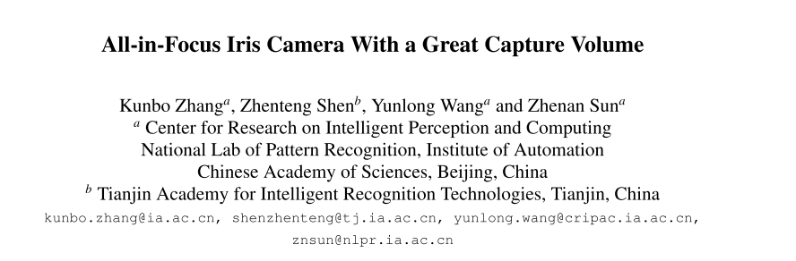
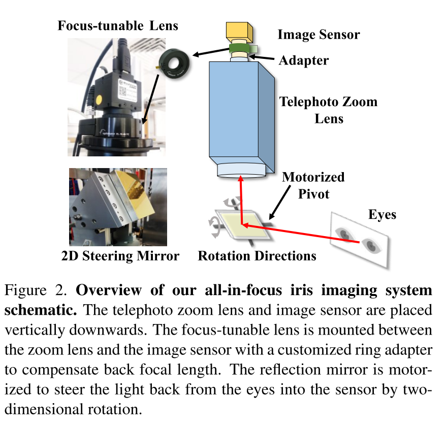

Zhang published paper, [All-in-Focus Iris Camera With a Great Capture Volume](../../publication/zhang-ijcb2020), wins the PC chairs choice best paper award runner-Up at [the 2020 International Joint Conference on Biometrics (IJCB 2020)](https://ieee-biometrics.org/ijcb2020/index.html).

The 2020 International Joint Conference on Biometrics (IJCB 2020) combines two major biometrics research conferences, the Biometrics Theory, Applications and Systems (BTAS) conference and the International Conference on Biometrics (ICB). The blending of these two conferences in 2020 is through a special agreement between the IEEE Biometrics Council and the IAPR TC-4, and should present an exciting event for the entire worldwide biometrics research community.

In this work, a novel all-in-focus iris imaging system is developed. It using a focus-tunable lens and a 2D steering mirror to greatly extend capture volume by spatiotemporal multiplexing method. Our iris imaging depth offield extension system requires no mechanical motion and is capable to adjust the focal plane at extremely high speed.

