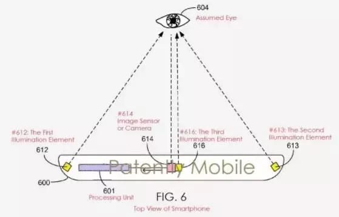

 
 &emsp;&emsp;2017年4月27日，微软获得了一项虹膜识别技术的专利，未来该技术将纳入 Windows Hello ，用于微软旗下的智能手机、笔记本等设备中。

 
 

 
&emsp;&emsp;虹膜识别是生物识别技术中的一种。其他的生物识别方法包括人脸、指纹、声音、视网膜、静脉识别等，而由于人类虹膜上拥有266个特征点，远高于其他生物识别技术的不到60个特征点，故被认为具有更高的精准性和安全性。

 &emsp;&emsp;虹膜识别是通过数学算法对人眼虹膜特征进行编码和对比的身份识别方法。根据专利文件描述，微软的智能设备可以从两个或者三个方向照明中拍摄用户眼睛的多张照片。每个角度的眼睛照片都能检测虹膜特征并创建不同的数据点。

 

 &emsp;&emsp;微软在其专利申请中指出，人眼是部分透明的三维结构。当光通过瞳孔传递到眼睛的视网膜上。从不同的方向用光照射眼睛，就可以获得许多图像帧的图像数据，并对至少两个图像帧的数据进行对比，找到相似的地方，获得相关的数据，这些数据与关注的眼睛区域是一致的。然后系统根据数据自动确定假眼睛的验证特点，从而用来验证真正的眼睛。
