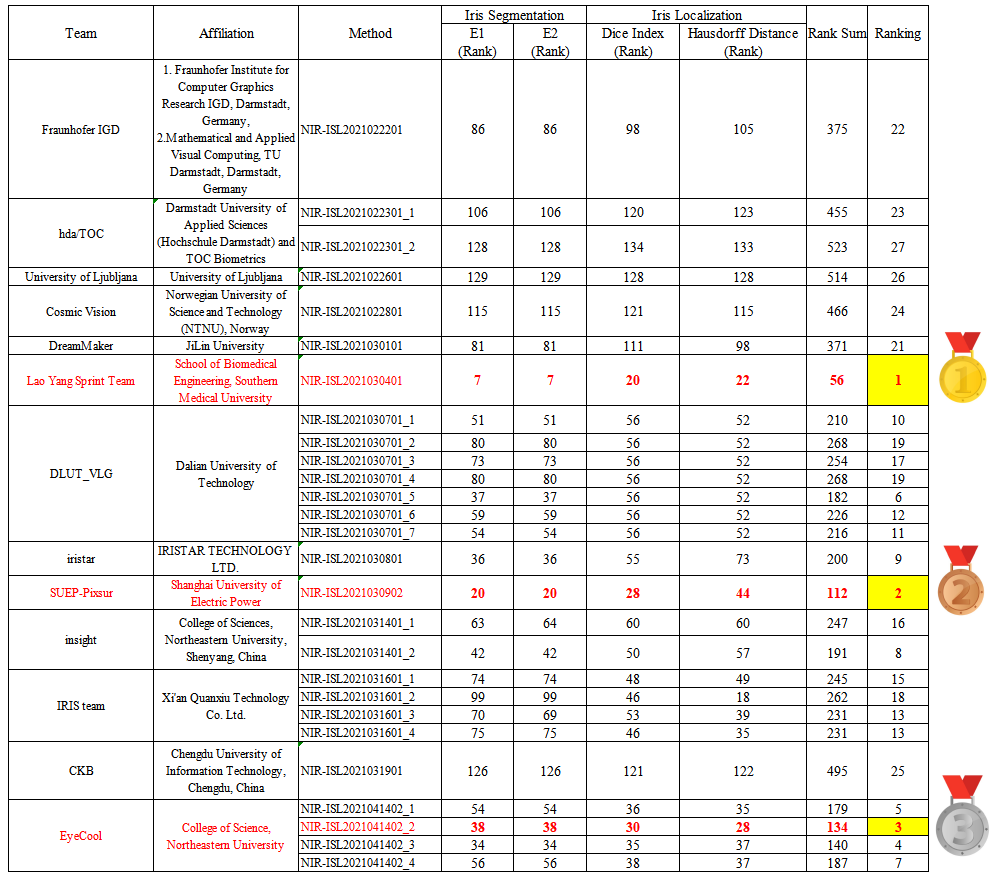

For iris recognition in non-cooperative environments, iris segmentation has been regarded as the first most important challenge still open to the biometric community, affecting all downstream tasks from normalization to recognition. In recent years, deep learning technologies have gained significant popularity among various computer vision tasks and have also affected the iris biometrics, especially iris segmentation. To investigate recent developments and attract more interests of researchers in the iris segmentation method, we are planning to host the challenge competition. In this challenge, we aim to benchmark the performance of iris segmentation on NIR iris images from Asian and African people captured in non-cooperative environments. Moreover, we specially split the general iris segmentation task in the conventional iris recognition pipeline into the segmentation of noise-free iris mask and the localization of inner and outer boundaries of the iris, which are narrowly referred to as iris segmentation and iris localization. Therefore, the challenge encourages the submission of a complete solution taking the iris segmentation and iris localization into consideration.

**Organisers**: Dr. Caiyong Wang, Dr. Yunlong Wang, Dr. Kunbo Zhang, Jawad Muhammad, Tianhao Lu, Prof. Qichuan Tian, Prof. Zhaofeng He, Prof. Zhenan Sun

**Preferred contact person**: Dr. Caiyong Wang, *wangcaiyong at bucea.edu.cn*

**Website**: [https://sites.google.com/view/nir-isl2021/home](https://sites.google.com/view/nir-isl2021/home)

**Schedule**:

    Registration closes: April 20, 2021
    Prediction results and technical reports submission deadline: April 20, 2021
    Results announcement: April 30, 2021

**More Competition**:[http://ijcb2021.iapr-tc4.org/competitions/](http://ijcb2021.iapr-tc4.org/competitions/)

---

## Result

ll together 30 research groups registered for NIR-ISL 2021, out of which 14 took part in the final round and submitted a total of 27 valid models for scoring.  

According to our ranking rules, each submitted entry was assigned one ranking score per evaluation metric and set of testing data. The final ranking was then obtained by adding all 4(evaluation metrics)x5(datasets)(=20) ranking scores (rank sum). The entry with the smallest sum was placed top in the final ranking.

The top-3 winning solutions of NIR-ISL 2021 are:

- **1st place: Lao Yang Sprint Team (Yiwen Zhang, Tianbao Liu, and Wei Yang, from School of Biomedical Engineering, Southern Medical University)**

- **2nd place: SUEP-Pixsur (Dongliang Wu, Yingfeng Liu, Ruiye Zhou, and Huihai Wu, from Shanghai University of Electric Power)**

- **3rd place: EyeCool (Hao Zhang, Junbao Wang, Jiayi Wang, and Wantong Xiong, from College of Science, Northeastern University)**

**Congratulations to them!**

Following are the team details and results. More details can be found in the future IJCB 2021 summary paper.  

