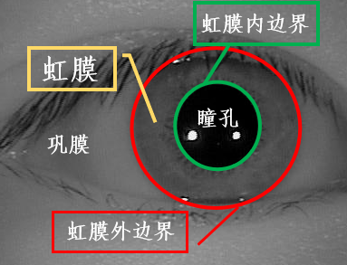

<strong> &emsp;&emsp;虹膜识别是进一步提升安全性、可靠性的必由之路</strong> &emsp;&emsp;&nbsp;&nbsp;&nbsp;
<strong> &emsp;&emsp;&emsp;&emsp;&emsp;&emsp;&emsp;&emsp;&emsp;&emsp;&emsp;&emsp;&emsp;&emsp;&emsp;&emsp;&emsp;&emsp;&emsp;&emsp;&emsp;&emsp;———谭铁牛院士</strong>  

&emsp;&emsp;虹膜识别是最具潜力的生物识别方法之一，是识别率高、非接触性、防欺骗性好的识别方法。虹膜属于人眼的一部分，如下图所示。

 

&emsp;&emsp;人眼的外观主要由巩膜、虹膜、瞳孔三部分组成，其中巩膜即眼球外围的白色部分，约占人眼总面积的30%，眼睛的中心为瞳孔部分，约占5%，虹膜位于巩膜和瞳孔之间，约占整个眼睛的65%，包含了最丰富的纹理信息，外观上看，虹膜由许多腺窝、褶皱、色素斑等构成，是人体中最独特的结构之一。因为瞳孔、虹膜和巩膜一般颜色不同，灰度值呈梯度变化，所以根据它们灰度不同，可以将它们明显分开。从几何形状可以看出，虹膜的内、外边界可以近似为圆形，这使它具有易检测性。临床观察发现：虹膜在人的一生当中几乎不发生变化，只有很少的虹膜纹理可能会由于年龄或者外伤导致纹理破坏。

&emsp;&emsp;作为表示个人身份的标识物，必须具备作为身份标识的重要特征。人脸、指纹等许多生物特征具有作为身份标识的特性，但是，虹膜在这些特性方面表现的更为突出，具有许多先天优势，是其他生物特征无法与之媲美的。

<ul type='circle'><li>普遍性————虹膜是每个人天生都具有的。</li><li>唯一性————虹膜的纤维组织细节复杂而丰富，每个人错综复杂的虹膜独一无二，只与虹膜的形成过程有关。</li><li>稳定性————虹膜从婴儿胚胎发育的第三个月起开始发育，到第八个月虹膜的主要纹理结构已经成形。</li><li>非入侵检测————从一定距离即可获得虹膜数字图像，无需用户接触设备。</li><li>可接受程度好————虹膜识别以其认证准确度高、速度快、安全性高，被用户所接受。</li><li>可检测性————利用图像处理技术检测出虹膜边界，易于拟合分割和和归一化</li><li>防伪性高————虹膜的半径小，在可见光下中国人的虹膜图像呈现深褐色，看不到纹理信息，需要虹膜图像专业采集设备和用户的配合，所以一般情况下很难被盗取</li><li>防欺骗性好————虹膜的唯一性决定了不同人眼的虹膜很难被冒充模仿。</li></ul>

&emsp;&emsp;生物特征识别通过捕获生物样本，然后采用数学方法把样本转化成相同大小的模板，提取有效的可区别性特征，就可以客观地和其他一个完整的虹膜身份识别系统主要由四个部分组成：虹膜图像获取、虹膜图像预处理、虹膜特征提取、模式比对。

<ol><li>虹膜图像获取</li>  
&emsp;虹膜图像采集的目的是为了获取有效的虹膜图像，在传统的虹膜识别场景中，通常采用专业的成像装置在近红外光（波长700nm到900nm）照射和用户的配合下才能捕获清晰的高分辨率虹膜图像。近些年来，随着光学镜头、传感器和计算成像技术等的发展，虹膜识别的可用距离不断变大，相关装置也变得越来越轻巧实用，“远距离”、“行进中”、“移动端”和“可见光下”等少约束场景的虹膜识别对于用户使用时的约束越来越少，极大地提升了虹膜识别应用范围和用户友好性。
<li>虹膜图像预处理</li>
虹膜图像除了必须的虹膜区域以外，也包含了诸如巩膜、睫毛、瞳孔等非虹膜区域，因此不能直接用于虹膜识别。其次，一些噪声茹照明变化、睫毛遮挡、镜面反射、瞳孔放缩等会明显增加虹膜的类内差异，降低虹膜的识别率。常规的虹膜预处理步骤包括：虹膜活体检测、虹膜图像质量评估、虹膜分割、虹膜归一化和虹膜图像增强。
<li>虹膜图像特征分析</li>
虹膜图像特征分析主要包含两部分：特征提取和对比分类。虹膜特征提取是指从归一化的虹膜图像中提取紧凑有区分的虹膜特征，然后使用计算机可以存储和读取的格式进行编码。虹膜比对和分类(或者称为匹配)是指将提取的虹膜特征编码和事先在数据库注册过的虹膜特征编码通过某种相似性度量比如汉明距离、余弦距离进行对比，计算相似性分数，依次确定用户身份。

